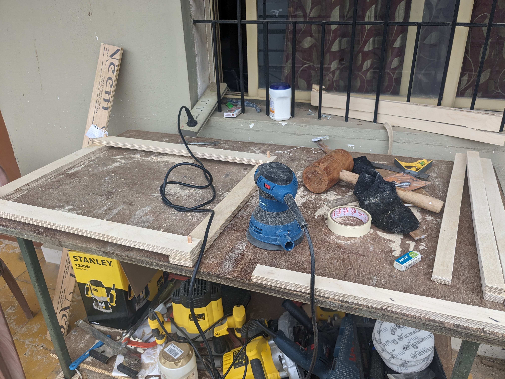

+++
author = "Eswar Malla"
date = 2023-12-06T21:00:00Z
description = ""
draft = false
slug = "projects"
title = "Carpentry : Shoe Rack"

+++

This is a shoe rack I made out of birch plywood. 

Stain : Shellac TeakWood : Walnut in 7 parts to 1 part. 

Polish : Asian Paints polish

